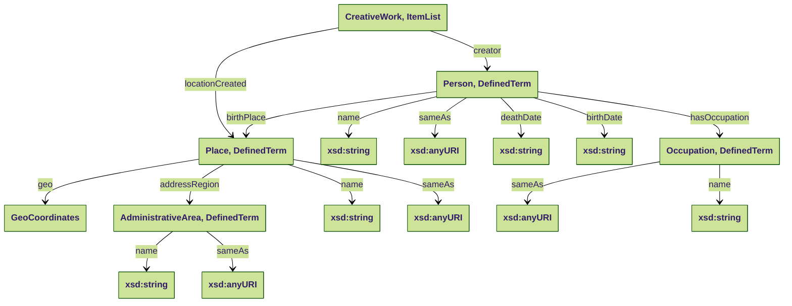
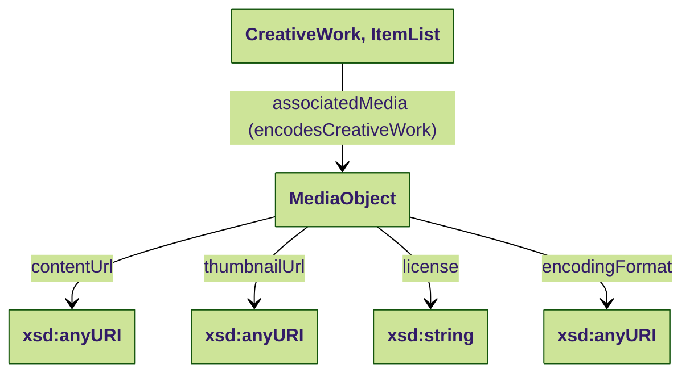
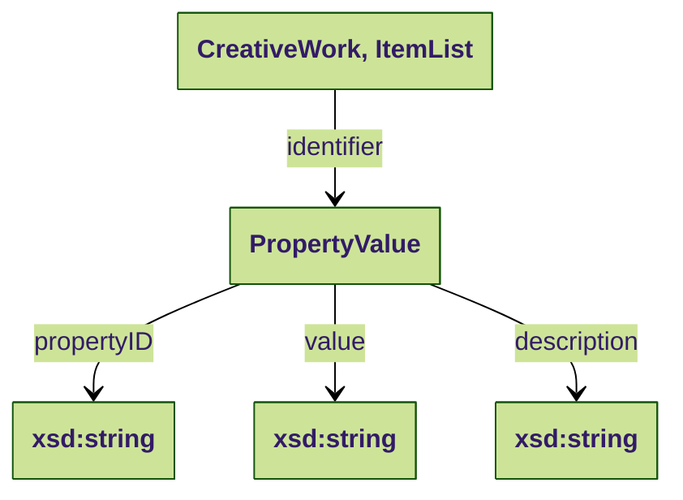
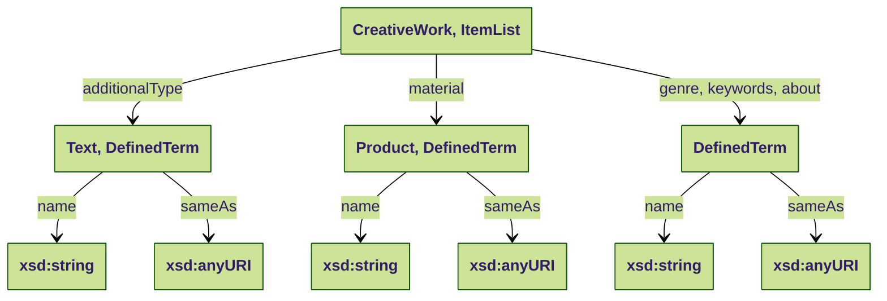

# collectie-nederland-schema-profile
This repository describes the schema profile developed for the platform [Collectie Nederland](https://collectienederland.nl/). It is a less-strict version of the [NDE Schema.org Application Profile](https://github.com/netwerk-digitaal-erfgoed/schema-profile), which is described [here](https://docs.nde.nl/schema-profile/). 

## Shacl-file

The shacl shape is located here: ```data/shacl.ttl```.

## Datamodel Overview

```mermaid
---
  config:
    theme: forest
    class:
      hideEmptyMembersBox: true
---
classDiagram
class creativework["CreativeWork, ItemList"]

class lit_1["xsd:string"]
creativework --> lit_1: dateCreated

class lit_24["xsd:anyURI"]
creativework --> lit_24: license

class lit_9["xsd:string"]
creativework --> lit_9: description

class lit_13["xsd:string"]
creativework --> lit_13: size

class lit_14["xsd:anyURI"]
creativework --> lit_14: isPartOf

class lit_17["xsd:anyURI"]
creativework --> lit_17: url

class lit_22["xsd:string"]
creativework --> lit_22: temporal

class lit_25["xsd:date"]
creativework --> lit_25: sdDatePublished

class additional["Text, DefinedTerm"]
class lit_27["xsd:string"]
class lit_28["xsd:anyURI"]
creativework --> additional: additionalType
additional --> lit_27: name
additional --> lit_28: sameAs

class product["Product, DefinedTerm"]
class lit_0["xsd:string"]
class lit_2["xsd:anyURI"]
creativework --> product: material
product --> lit_0: name
product --> lit_2: sameAs

class defterm["DefinedTerm"]
class lit_29["xsd:string"]
class lit_30["xsd:anyURI"]
creativework --> defterm: genre, keywords, about
defterm --> lit_29: name
defterm --> lit_30: sameAs

class place["Place, DefinedTerm"]
class geocoor["GeoCoordinates"]
class adminarea["AdministrativeArea, DefinedTerm"]
class lit_3["xsd:string"]
class lit_4["xsd:anyURI"]
class lit_31["xsd:string"]
class lit_32["xsd:anyURI"]
creativework --> place: locationCreated
place --> lit_3: name
place --> lit_4: sameAs
place --> geocoor: geo
place --> adminarea: addressRegion
adminarea --> lit_31: name
adminarea --> lit_32: sameAs

class person["Person, DefinedTerm"]
class lit_5["xsd:string"]
class lit_6["xsd:anyURI"]
class lit_7["xsd:string"]
class lit_8["xsd:string"]
class lit_15["xsd:anyURI"]
class lit_16["xsd:string"]
creativework --> person: creator
person --> lit_5: name
person --> lit_6: sameAs
person --> lit_7: deathDate
person --> lit_8: birthDate
person --> place: birthPlace

class occupation["Occupation, DefinedTerm"]
class lit_15["xsd:anyURI"]
class lit_16["xsd:string"]
person --> occupation: hasOccupation
occupation --> lit_15: sameAs
occupation --> lit_16: name

class mediaobject["MediaObject"]
class lit_10["xsd:anyURI"]
class lit_11["xsd:anyURI"]
class lit_12["xsd:string"]
class lit_23["xsd:anyURI"]
creativework --> mediaobject: associatedMedia (encodesCreativeWork)
mediaobject --> lit_10: contentUrl
mediaobject --> lit_11: thumbnailUrl
mediaobject --> lit_12: license
mediaobject --> lit_23:encodingFormat

class propval["PropertyValue"]
class lit_18["xsd:string"]
class lit_19["xsd:string"]
class lit_20["xsd:string"]
creativework --> propval: identifier
propval --> lit_18: propertyID
propval --> lit_19: value
propval --> lit_20: description

class copyperson["Person"]
class lit_21["xsd:string"]
creativework --> copyperson: copyrightHolder
copyperson --> lit_21: name

```



### Person, Place, Occupation 



### MediaObject


### identifier


### additionalType, material, genre, keywords en about

